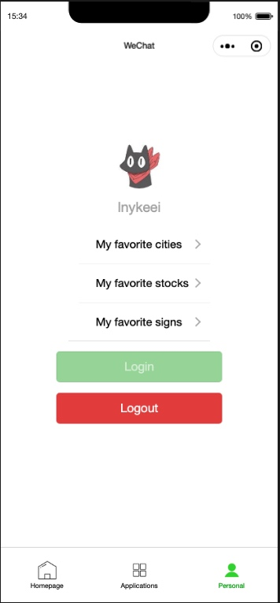

# WeChatProjects

+ Backend:
  + Language: Python
  + Server: Nginx
  + Framework: Django
  + Database: MySQL
 
+ Frondend:
  + HTML/CSS
  + Javascript

+ Deployed Platform
  + AWS EC2

+ Highlights
  + APIs management
  + Django self-designed middlewares
  + cron jobs, cache and logger components usage 
  + RESTful url design
  + Database performance optimization
  + System high availability 

+ Demmo
  * Log in page: in this page, you can login or logout your account, the index page will display different information according to different users. Plus, you can add your favorite city (for weather), stocks and signs. 
  

    
  
